# 🧸 Claw Friends

A **cozy 3D anime-style claw machine arcade** for the browser. Walk Kyoko around a pastel arcade, play sixteen physics claw machines, fill your cart with plush friends, swap five small ones for a BIG one and check out at the cashier. Every day brings new requests, every star unlocks something new to wear.


**Play it:** https://claw-friends.vercel.app · also on [itch.io](https://gianneangely.itch.io/claw-friends)

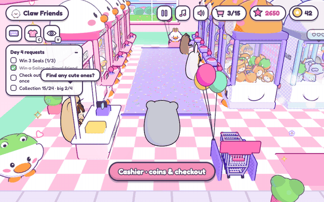

## The arcade

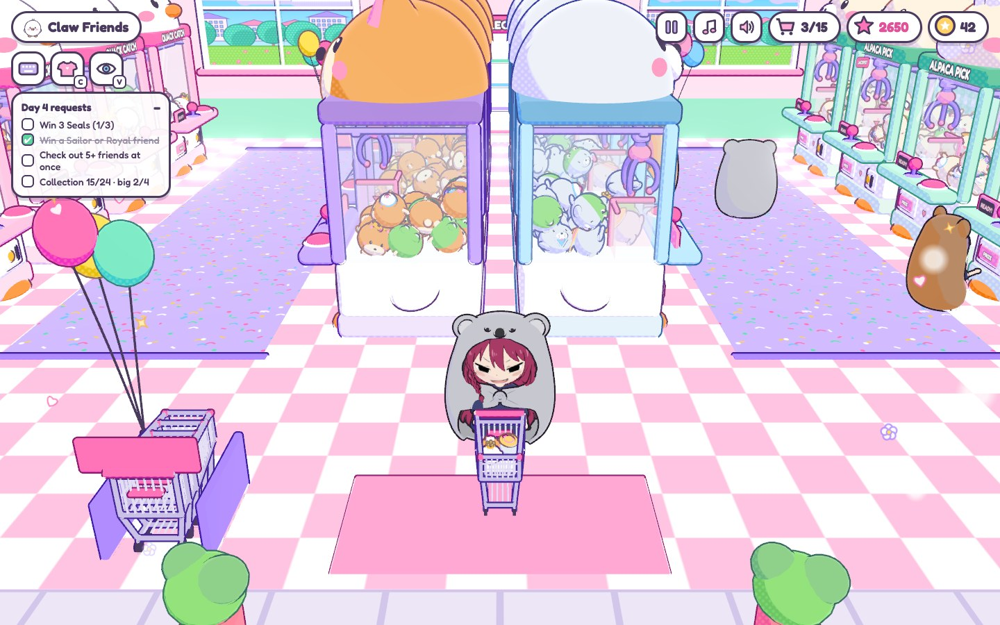

Four rows of machines (Quack Catch, Shiba Scoop, Seal Splash and Alpaca Pick), each full of six kinds of plush friends from common to rare. The rows open one by one as you win. Other kids wander the aisles, play machines, cheer when they win and make room when you walk up. The cashier and the swap staff say hello when you pass by.

## Catch a friend

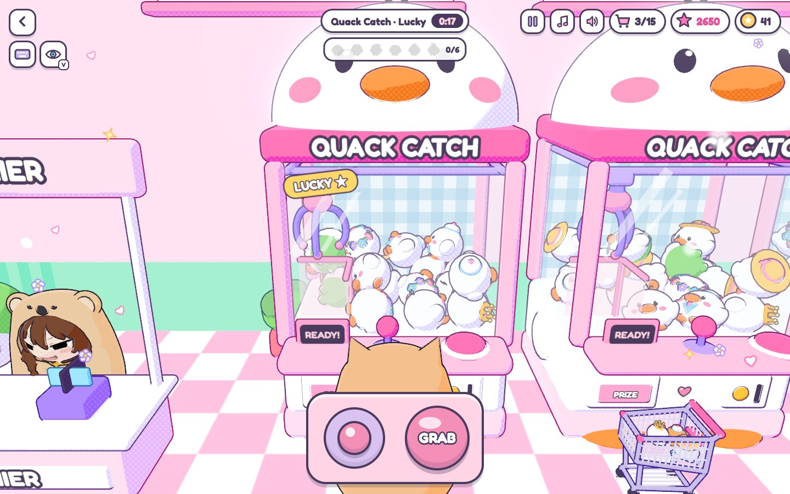

Every machine runs real physics: the plushies pile up, the claw sways, the prongs close round whatever they touch, and a friend can slip on the way to the chute. One play costs one coin.

- **Lucky** machines have a stronger claw
- **Jackpot** machines drop rare friends far more often, but their claw is weaker
- One machine a day is **★x2**: double stars all day
- Two friends from one grab is a **combo** (double stars). About one win in sixteen is **shiny** (triple stars)
- The game slows down for a moment while a friend is carried over the chute

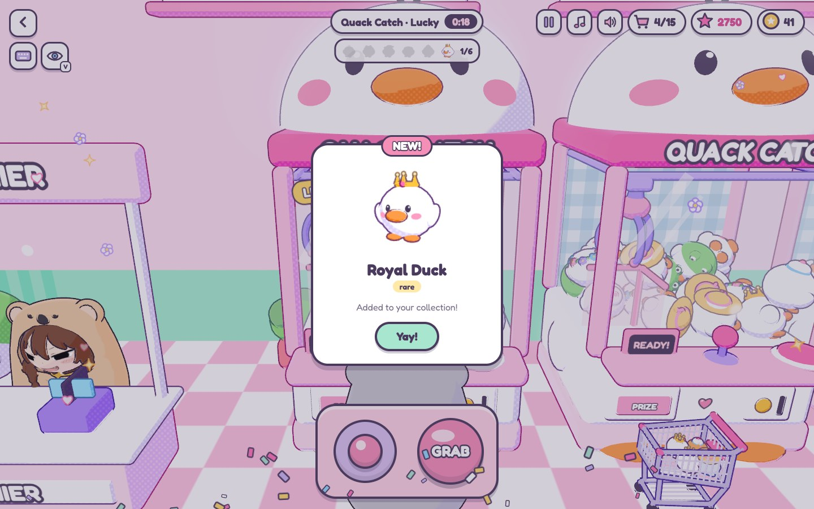

## Collect them all

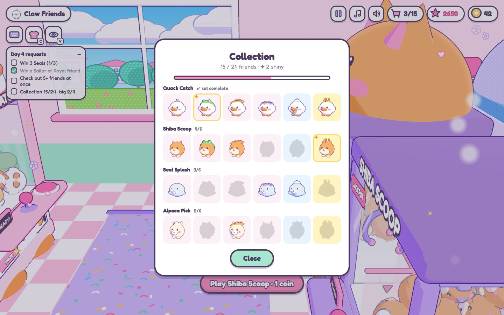

Won friends ride in your cart. Check out at the cashier to put the new ones on your shelf; extra copies are bought back for a coin each. Five small friends can be swapped for a BIG friend at the Big Swap booth, and big friends sit on pedestals by the shelf. A full set of six earns a bonus.

After the four starter goals, each **day** brings three requests ("Win 3 Seals", "Check out 5+ friends at once"). Finish them for coins and stars, then the next day starts.

## Dress up Kyoko

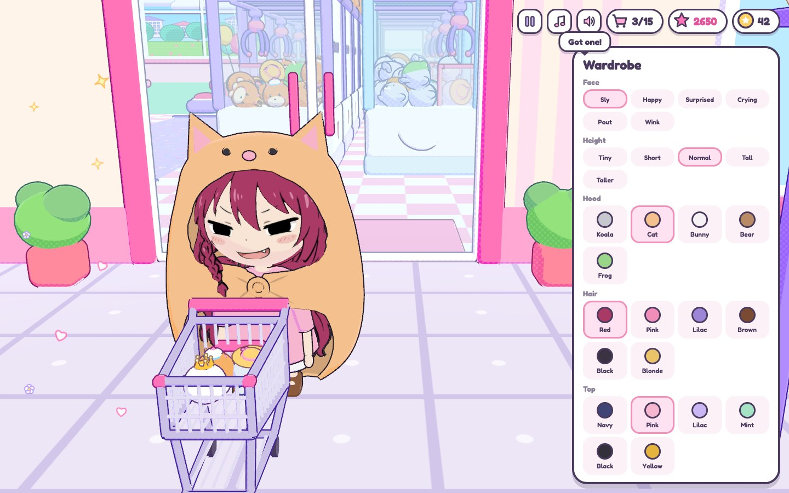

Stars unlock outfits in the wardrobe:

- **Face**: sly, happy, surprised, crying, pout or wink
- **Height**: tiny to taller
- **Hood**: koala, cat, bunny, bear or frog
- **Hair**: six colours
- **Top, bottom, shoes**: six of each (sneakers, canvas, Mary Janes, boots, rain boots, slippers)

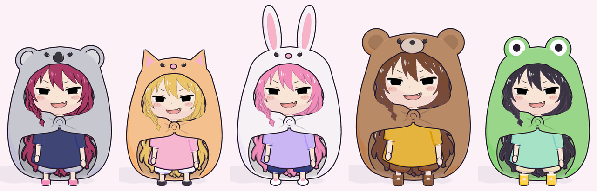

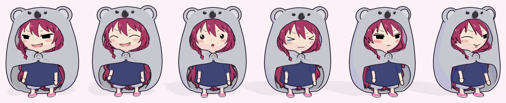

## More to see

| First person | Night |
| --- | --- |
| 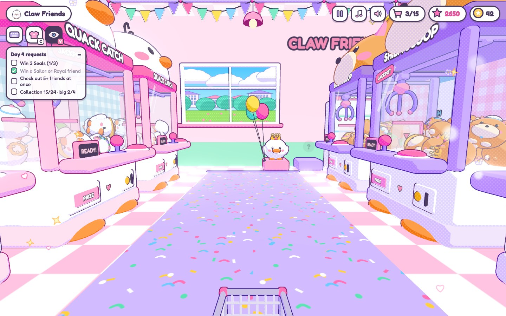 | 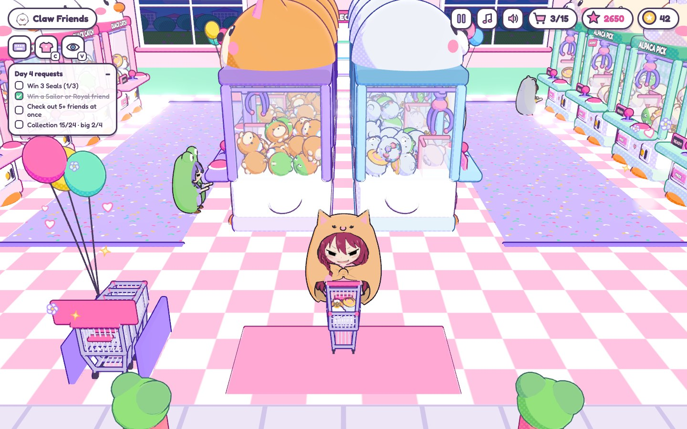 |

- **First person**: press V to see through Kyoko's eyes, at the machines too (step round a machine with the arrow keys to look through its side glass)
- **Time of day**: the windows follow your clock, and the machines glow a little more at night
- **Title screen, pause menu and settings**: music and sound volume, camera speed, light or pretty graphics, reset progress
- **Automatic graphics**: a slow computer switches to light graphics by itself
- **Phones**: played in landscape, with a joystick and touch buttons

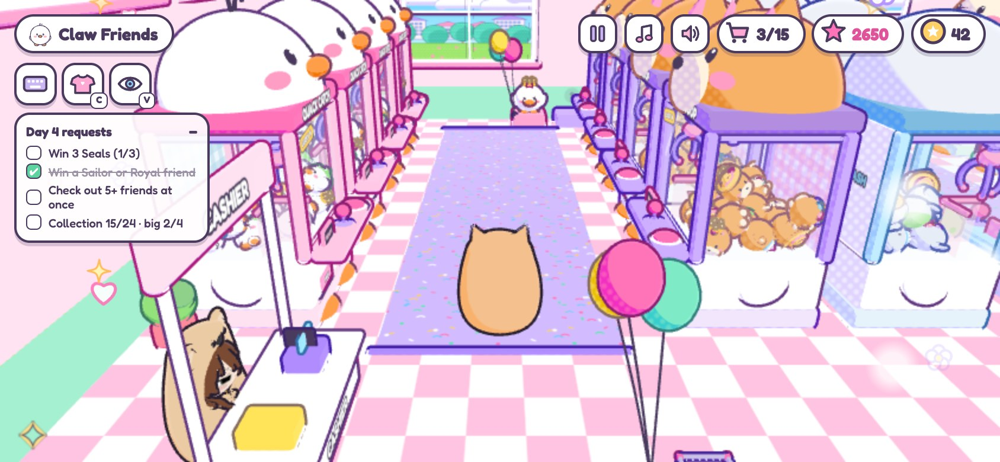

## Controls

- **WASD** — walk, or move the claw at a machine
- **E / Space** — use, grab
- **Arrow keys or drag** — look around
- **V** — first person
- **C** — wardrobe
- **H** — put the cart away (your friends stay in it)
- **G** — fold the goals list
- **Q** — leave a machine
- **P / Esc** — pause, close a card (in full screen Esc leaves full screen, so use Q and P there)

## From drawing to 3D

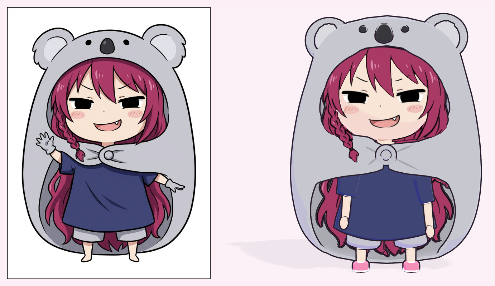

Kyoko is built from a single front-view drawing. Python scripts measure the drawing, cut it into part masks (hood, hair, face, braid, top, shorts...) and inflate each mask into a mesh along depth curves. Blender then adds the armature and exports the model. Her face and hair stay painted from the drawing itself, and the game draws ink outlines round everything else.

## Run locally

```bash
git clone https://github.com/GianneAngely/claw-friends.git
cd claw-friends/game
npm install
npm run build
open dist/index.html
```

The built game is a single page that runs straight from `dist/index.html`. A push to `main` deploys to Vercel.

Handy URL parameters while working on it:

- `?play` — skip the title screen
- `?demo` — a mid-game save (separate from your real one)
- `?quality=low` or `?quality=high` — try a graphics setting
- `?hour=21` — try a time of day
- `?test=flow` / `?test=claw` — scripted checks of the whole loop and of the claw

## What's inside

- **game/** — the game: arcade room, claw physics, plushies, Kyoko and the visitors, progression, UI and synthesized music
- **blender/** — the pipeline that turns Kyoko's drawing into `game/assets/kyoko.glb`, plus her face expressions
- **refs/** — art direction and Kyoko's character options
- **mockup/, mockup3d/** — the first 2D and 3D mockups
- **tools/** — headless Chrome screenshots and clips for checking the game
- **docs/** — the images in this README

## Built with

Three.js · Rapier · esbuild · Blender · Python

Plain JavaScript, bundled into one file; every sound and the music are synthesized live with Web Audio.
