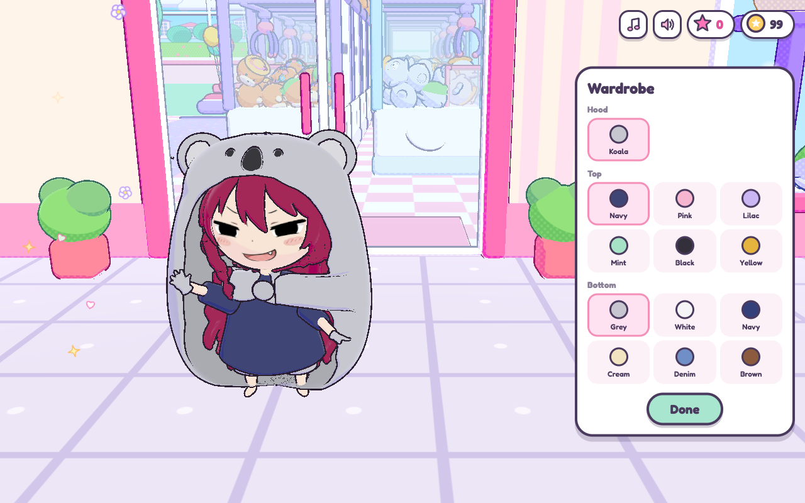

# 🧸 Claw Friends

A **3D anime-style claw machine arcade** for the browser. Walk Kyoko around a cozy arcade full of claw machines, grab plush friends with a physics claw, fill your cart, swap five small friends for a big one and check out at the cashier.



## Run locally

```bash
git clone https://github.com/GianneAngely/claw-friends.git
cd claw-friends/game
npm install
npm run build
open dist/index.html
```

## How to play

- Start from the title screen, grab a cart by the door and play the claw machines (1 coin a go).
- Won friends ride in your cart. Swap 5 small ones for a BIG friend, then check out at the cashier to put new friends on your shelf.
- After the starter goals, every **day** brings three requests. Finish them for coins and stars.
- **Stars** unlock outfits in the wardrobe: faces, sizes, animal hoods, hair colours, tees and shorts.
- Machine rows open as you win. Look out for **Lucky** (strong claw), **Jackpot** (more rare friends) and the day's **★x2** machine.
- Some wins are **shiny** (triple stars). A full set of 6 earns a bonus.

## Controls

- **WASD**: walk, or move the claw at a machine
- **E / Space**: use, grab
- **Arrow keys or drag**: look around
- **V**: first-person view
- **C**: wardrobe
- **H**: put the cart away
- **G**: fold the goals list
- **Esc**: pause, or leave the machine

## What's inside

- **game/** — the game: arcade room, physics claw, cart, big swap booth, cashier, wardrobe, music
- **blender/** — Kyoko's 3D model, built from her reference art (part masks → meshes → Blender → `game/assets/kyoko.glb`) plus her face expressions
- **refs/** — art direction moodboards and Kyoko's character options
- **mockup/, mockup3d/** — early 2D and 3D mockups
- **tools/cdpshot.mjs** — headless Chrome screenshots for checking the game

## Built with

Three.js · Rapier · esbuild · Blender

Plain JavaScript bundled into one file, so the built game runs straight from `dist/index.html`.
